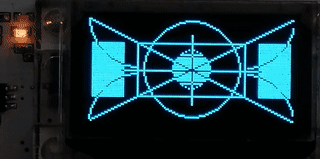

# NanofWifiKit32 projects
Different samples for Wifikit32 & WifiLoRa32 (ESP32 board) written using the Wonderful nanoframework.

## Prerequisites & introduction

* [Nanoframework](https://www.nanoframework.net/) is an open-source light .NET Framework (CLR + BCL) for embeddedMCU (such as ESP32, ...) and a very powerfull integration with Visual Studio ecosystem (extension for free [VS219 Community Edition] with full codebuild/debug/deploy features, nuget package integration, ...). 
The project joined the [.Net Foundation](https://dotnetfoundation.org/projects/nanoframework) in october 2020.

* a supported board :
  * [WifiKit32](https://heltec.org/project/wifi-kit-32/) is a cheap ESP32 based developper board support Wifi & Bluetooth Low Emission (BLE). It integrates a USB programmer port, LiPo battery management and an OLED screen  (0.96' 128x64 pixel).

  * [WifiLoRa32](https://heltec.org/project/wifi-lora-32/) : a version of WifiKit32 with a LoraWan modem onbard.

  * Others boards supporting Nanoframework should works by adapting GPIO/I2C port number. 
  
    _Don't hesitate to share your successfull attempts with me. I will relay it here._

----

# Projects

## Wifikit32Common (library)

A set common class, constant, helper, framework for Heltec Wifikit32.
## LoRa32Common (library)

A set common class, constant, helper, framework for Helter WifiLoRa32.
## [BlinkyLed](src/BlinkyLed/) (exe)

___Compatibility : WifiKit32 | WifiLoRa32.___

// *The iot hello world !* //

This program blink the wifikit32 onboard led (hard wired to GPIO 25). 

It the simplest test to check if the whole dev/compile/deploy chain works with a visual confirmation (the blinking led + debug counter increasing printed on debug output)

## [HellOled](src/HellOled/) (exe)

___Compatibility : WifiKit32 | WifiLoRa32.___

 A hello world sample for the onboard Oled screen using the nativ Nanoframework library for OLED screen.

 This project use the first version of display libraries for SSD1306 oled screen (as the test program :

* Heltec board specifity :
  * [WifiKit32](src/WifiKit32Common/)
  * [LoRa32](src/WifiLora32)
* Oled Display management for displaybased on SSD1306 controller : [OledSSD1306](src/OledSSD1306/)
* Sample fonts : [OledFonts](src/OledFonts/)
* Sample bitmaps : _Not yet externalized_.
